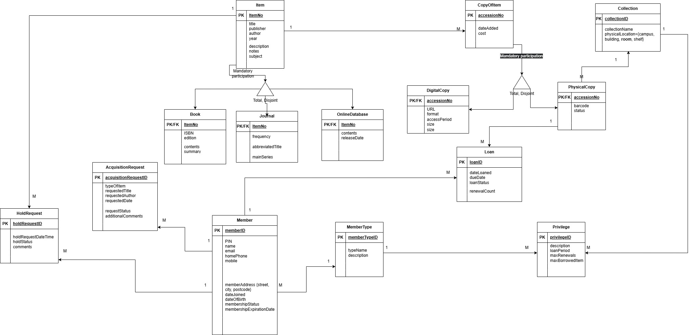

## Assignment 1 — Conceptual Database Design

This stage focuses on analysing requirements and developing a conceptual model for the UNIE Library System using an Enhanced Entity Relationship (EER) approach.

### Key Components

* Requirements analysis and business rules
* Resource classification using specialisation (Book, Journal, OnlineDatabase)
* Copy management (PhysicalCopy and DigitalCopy)
* Membership and borrowing privilege modelling
* Loan, HoldRequest, and AcquisitionRequest workflows
* Data dictionary documentation

### Artefacts

* Conceptual design report
* EER diagram
* Requirements specification

This conceptual model establishes the foundation for logical schema mapping and implementation in subsequent assignment stages.
